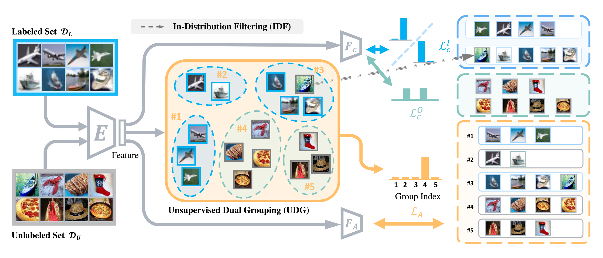

# SCOOD-UDG (ICCV 2021)

[](https://arxiv.org/abs/2108.11941)
&nbsp;
[](https://jingkang50.github.io/projects/scood)
&nbsp;
[](https://drive.google.com/file/d/1cbLXZ39xnJjxXnDM7g2KODHIjE0Qj4gu/view?usp=sharing)&nbsp;
[](https://entuedu-my.sharepoint.com/:u:/r/personal/jingkang001_e_ntu_edu_sg/Documents/scood_benchmark.zip?csf=1&web=1&e=vl8nr8)


This repository is the official implementation of the paper:
> **Semantically Coherent Out-of-Distribution Detection**<br>
> Jingkang Yang, Haoqi Wang, Litong Feng, Xiaopeng Yan, Huabin Zheng, Wayne Zhang, Ziwei Liu<br>
> Proceedings of the IEEE International Conference on Computer Vision (**ICCV 2021**)<br>



## Dependencies
We use `conda` to manage our dependencies, and CUDA 10.1 to run our experiments.

You can specify the appropriate `cudatoolkit` version to install on your machine in the `environment.yml` file, and then run the following to create the `conda` environment:
```bash
conda env create -f environment.yml
conda activate scood
```

## SC-OOD Dataset


The SC-OOD dataset introduced in the paper can be downloaded here.

[](https://drive.google.com/file/d/1cbLXZ39xnJjxXnDM7g2KODHIjE0Qj4gu/view?usp=sharing)&nbsp;[](https://entuedu-my.sharepoint.com/:u:/r/personal/jingkang001_e_ntu_edu_sg/Documents/scood_benchmark.zip?csf=1&web=1&e=vl8nr8)

Our codebase accesses the dataset from the root directory in a folder named `data/` by default, i.e.
```
├── ...
├── data
│   ├── images
│   └── imglist
├── scood
├── test.py
├── train.py
├── ...
```


## Training
The entry point for training is the `train.py` script. The hyperparameters for each experiment is specified by a `.yml` configuration file (examples given in [`configs/train/`](configs/train/)).

All experiment artifacts are saved in the specified `args.output_dir` directory.

```bash
python train.py \
    --config configs/train/cifar10_udg.yml \
    --data_dir data \
    --output_dir output/cifar10_udg
```

## Testing
Evaluation for a trained model is performed by the `test.py` script, with its hyperparameters also specified by a `.yml` configuration file (examples given in [`configs/test/`](configs/test/))

Within the configuration file, you can also specify which post-processing OOD method to use (e.g. ODIN or Energy-based OOD detector (EBO)).

The evaluation results are saved in a `.csv` file as specified.

```bash
python test.py \
    --config configs/test/cifar10.yml \
    --checkpoint output/cifar10_udg/best.ckpt \
    --data_dir data \
    --csv_path output/cifar10_udg/results.csv
```

## Results

### CIFAR-10 (+ Tiny-ImageNet) Results on ResNet18

You can run the following script (specifying the data and output directories) which perform training + testing for our main experimental results:

**CIFAR-10, UDG**
```bash
bash scripts/cifar10_udg.sh data_dir output_dir
```

We report the mean ± std results from the current codebase as follows, which match the performance reported in our original paper.

| Metrics           |         ODIN |          EBO |           OE |     UDG (ours)   |
| :---------------  | -----------: | -----------: | -----------: | ---------------: |
| FPR95 ↓           | 50.76 ± 3.39 | 50.70 ± 2.86 | 54.99 ± 4.06 | **39.94** ± 3.77 |
| AUROC ↑           | 82.11 ± 0.24 | 83.99 ± 1.05 | 87.48 ± 0.61 | **93.27** ± 0.64 |
| AUPR In ↑         | 73.07 ± 0.40 | 76.84 ± 1.56 | 85.75 ± 1.70 | **93.36** ± 0.56 |
| AUPR Out ↑        | 85.06 ± 0.29 | 85.44 ± 0.73 | 86.95 ± 0.28 | **91.21** ± 1.23 |
| CCR@FPRe-4 ↑      |  0.30 ± 0.04 |  0.26 ± 0.09 |  7.09 ± 0.48 | **16.36** ± 4.33 |
| CCR@FPRe-3 ↑      |  1.22 ± 0.28 |  1.46 ± 0.18 | 13.69 ± 0.78 | **32.99** ± 4.16 |
| CCR@FPRe-2 ↑      |  6.13 ± 0.72 |  8.17 ± 0.96 | 29.60 ± 5.31 | **59.14** ± 2.60 |
| CCR@FPRe-1 ↑      | 39.61 ± 0.72 | 47.57 ± 3.33 | 64.33 ± 3.44 | **81.04** ± 1.46 |


## License and Acknowledgements
This project is open-sourced under the MIT license.

The codebase is refactored by Ang Yi Zhe, and maintained by Jingkang Yang and Ang Yi Zhe.

## Citation
If you find our repository useful for your research, please consider citing our paper:
```bibtex
@InProceedings{yang2021scood,
    author = {Yang, Jingkang and Wang, Haoqi and Feng, Litong and Yan, Xiaopeng and Zheng, Huabin and Zhang, Wayne and Liu, Ziwei},
    title = {Semantically Coherent Out-of-Distribution Detection},
    booktitle = {Proceedings of the IEEE International Conference on Computer Vision},
    year = {2021}
}
```
